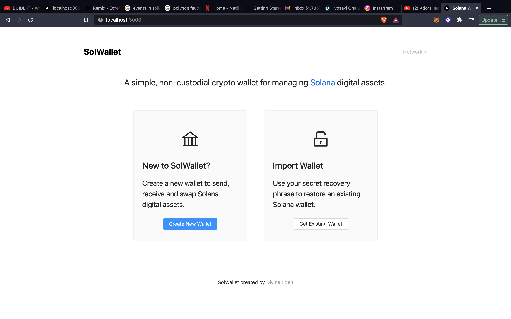

#SolWallet



## 🤔 What is the `wallet-dapp`?

Crypto wallets are one of the foundations of Web 3. They are the gateway application into crypto ecosystems by enabling users to interact with blockchain protocols and manage digital assets.

Under the hood, wallets leverage cryptographic technologies to generate and recover private keys - a concept that we'll define in the course of this tutorial. Those private keys give users access to public accounts that record ownership on a blockchain and expand the internet's functionality from a global network for information exchange to a global network for disintermediated economic exchange.

## 🧑‍💻 Details
Built with Nextjs and Typescript.

Make sure you have [git](https://git-scm.com/book/en/v2/Getting-Started-Installing-Git), [Node](https://nodejs.org/en/) and [yarn](https://yarnpkg.com/getting-started/install) installed. Then clone the repo and run the `yarn` command to install the app dependencies:

```
git clone https://github.com/nmasi322/Solana-Wallet.git
cd Solana-Wallet
yarn
```
## 💻 Running the development server
Start the Next.js development server on the default port 3000 with:

```
yarn dev
```

> Alternatively, run `yarn dev -p 8080` or any port other than `8080` to start the server in a different port.

Once the server is running, you can now view the running application at [http://localhost:3000](http://localhost:3000)

